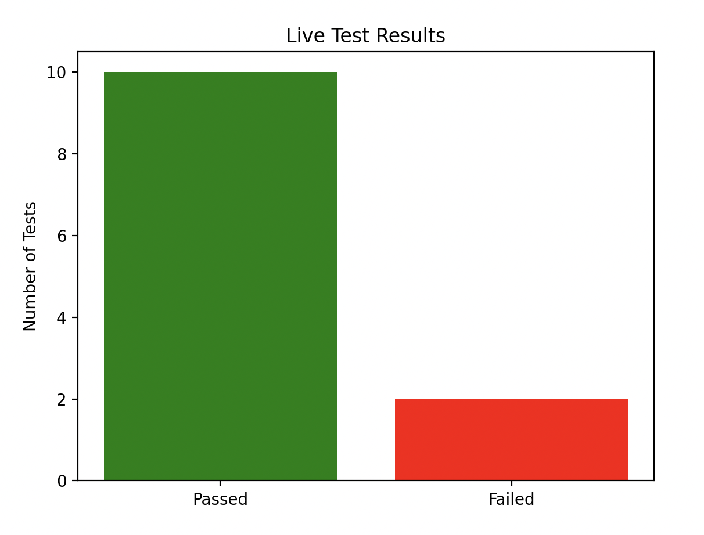

# robotframework-listener-example

Simple example of how to use a **custom listener** in [Robot Framework](https://robotframework.org/robotframework/latest/RobotFrameworkUserGuide.html#listener-interface).

Demonstrates:
- How to implement a very basic **listener** for Robot Framework using **Listener API v3** (available in **Robot 7.0+**).
- How to **monitor test execution** live using **console logging** and **a real-time matplotlib chart**.

## Files

### `listener.py`
**A basic Robot Framework listener** implemented as a module using **Listener API v3**:
- Logs **suite and test execution details** into a file (`listener_output.log`).
- **Usage**: Run it with a Robot test suite:
  ```bash
  robot --listener path/to/listener.py tests_cases
  ```
- **Output:** Generates a log file with test results.

---

### `live_summary_from_file_to_console.py`
**A live console summary** of test results:
- Reads `listener_output.log` in real-time.
- Displays test progress as:
  ```
  ✅ Passed: X  ❌ Failed: Y
  ```
- **Usage**:
  ```bash
  python3 live_summary_from_file_to_console.py
  ```

---

### `live_summary_from_file_to_chart.py`
**A live matplotlib chart** for test results:
- Reads `listener_output.log` in real-time.
- Displays a **dynamic bar chart** showing **passed vs failed** tests.
- **Requires:** `matplotlib`
- **Run the script**:
  ```bash
  python3 live_summary_from_file_to_chart.py
  ```
  

